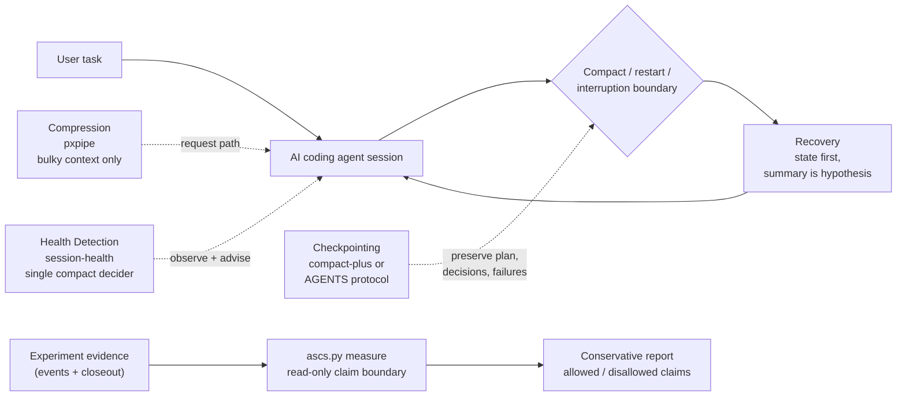

# Agent Session Control Stack

長時間動作する AI コーディングエージェントのための参照アーキテクチャ。

English: [README.md](README.md)

## Quickstart（5分）

```bash
claude plugin marketplace add House-lovers7/agent-session-control-stack
claude plugin install ascs@ascs
```

その後 Claude Code 内で `/ascs:doctor` を実行してください — どの層が有効か、single compact decider ルールが保たれているかを read-only で診断します。

full stack（健全性検知 + 状態保存/復旧）を導入する場合:

```bash
claude plugin install session-health@ascs
claude plugin install compact-plus@ascs
```

プラグインは**参照のみ**で列挙しており、インストールは各作者の原本リポジトリを無改変で取得します。pxpipe（圧縮層）は proxy でありプラグインではないため、別途オプトインです。詳細は後述の「インストール（marketplace）」節を参照してください。

## What this repo is / is not

- これは長時間 AI コーディングエージェントセッションのための **reference stack です**。
- これは **ベンチマークではありません**。
- upstream のコードは**同梱しません** — プラグインは各作者の原本リポジトリを参照インストールします。
- 長時間セッションを compact・再起動をまたいで**診断し、状態を保存する**ためのものです。
- 合成効果（3 層を同時に走らせた効果）は**まだ実証されていません** — 後述の「Evidence status」を参照。

## Problem

長時間の AI コーディングエージェントは、決まったパターンで劣化します。

- コンテキストの肥大
- cache 再読込の浪費
- compact による状態喪失
- 失敗したアプローチの反復
- plan / worker 構成の消失
- 要約後の危険な再開（要約を事実と誤認する）

## Thesis

これを 1 つの問題として扱わず、4 つの層に分離します。

1. **Compression（圧縮）** — 肥大した入力コンテキストを圧縮する
2. **Health Detection（健全性検知）** — セッションの過熱を検知し、モデル自身を介して介入する
3. **Checkpointing（状態保存）** — 文脈が失われる前に plan・決定・失敗試行・worker 構成を保存する
4. **Recovery（復旧）** — 安全に再開する: *要約は仮説、原本が真実*

層の契約は独立しており、単体で導入・撤去できます（binding 上の注意が 1 点: Claude Code では Checkpoint と Recovery は同一 plugin（compact-plus）で提供されるため、対で導入・撤去されます）。

## Architecture at a glance



Architecture と claim-boundary の導線:
- [docs/architecture.md](docs/architecture.md) — なぜ 4 層なのか、なぜ 3 upstream project を置き換えないのか、なぜ claim boundary が architecture の一部なのか
- [docs/claim-boundary-model.md](docs/claim-boundary-model.md) — `measure` の判定ルール、allowed / disallowed claims、void / stopped / incomplete の分類
- [HTML architecture view](docs/architecture.html)

## Existing projects

- [pxpipe](https://github.com/teamchong/pxpipe)（teamchong）: 圧縮層
- [claude-code-session-health](https://github.com/House-lovers7/claude-code-session-health)（House-lovers7）: 健全性検知層
- [compact-plus](https://github.com/u-ichi/compact-plus)（u-ichi）: 状態保存・復旧層

本リポジトリはこれらを**置き換えません**。コードも同梱しません。安全な組み合わせ方を文書化するものです。

## Claude Code reference stack

> - 畳み時の判定は **session-health** に任せる。
> - compact 前後の状態保存・復元は **compact-plus** に任せる。
> - 肥大した入力の圧縮は **pxpipe** に任せる。ただし byte-exact な値は決して圧縮しない。

合成を衝突させない 1 つのルール: session-health と compact-plus は、それぞれ異なる基準でモデルに compact を促せます。本 stack は **session-health を唯一の判定者**と定め、compact-plus の reminder を**設定ではなく構成で**無効化します。reminder は外部 statusline が warn marker ファイルを書いたときだけ発火するため、marker 生成器を導入しなければ一度も発火せず、state 保存・復旧注入は無傷で動き続けます。

### インストール（marketplace）

```bash
claude plugin marketplace add House-lovers7/agent-session-control-stack
claude plugin install session-health@ascs
claude plugin install compact-plus@ascs
claude plugin install ascs@ascs        # 任意: /ascs:doctor（read-only の stack 診断）
```

上流プラグインは**参照のみ**で列挙しています。インストールは各作者の原本リポジトリ（[House-lovers7/claude-code-session-health](https://github.com/House-lovers7/claude-code-session-health)、[u-ichi/compact-plus](https://github.com/u-ichi/compact-plus)）を無改変で取得します — 同梱・fork・改名は一切しません（[ATTRIBUTION.md](ATTRIBUTION.md) 参照）。pxpipe はリクエスト経路の proxy でありプラグインにはできないため、別途オプトインです（先に [Safety](#safety) を読むこと）:

```bash
npx -y pxpipe-proxy                    # 127.0.0.1:47821 で proxy 起動
alias claude-px='ANTHROPIC_BASE_URL=http://127.0.0.1:47821 claude'
```

- セットアップ・hook 責務・env 規約: [docs/claude-code/recommended-stack.md](docs/claude-code/recommended-stack.md)
- 設定スニペット: [examples/claude-code/settings.example.json](examples/claude-code/settings.example.json)
- エンドツーエンド統合ウォークスルーとデモ例: [docs/claude-code-reference-integration.md](docs/claude-code-reference-integration.md) · [examples/claude-code/stack-demo/](examples/claude-code/stack-demo/)

## Codex reference stack

Claude Code adapter と Codex adapter は**意図的に分離**しています — 同じ層契約を、各 runtime のネイティブな面で実装します。Codex には compact lifecycle hook が無いため、本 stack はそれを模倣しません。同じ Checkpoint / Recovery の契約を **session handoff protocol** として実装します。`AGENTS.md` が「作業前に `.agent-session/handoff.md` と state ファイルを読む」「作業中に決定と失敗試行を記録する」「停止前に handoff を書く」を宣言します。checkpoint スナップショットは compact-plus の state file と同じ 10 セクションを使うため、handoff は runtime をまたげます。

これは hook より弱い保証（決定論的実行ではなく protocol 遵守）であり、そのことを明記しています。

- 設計: [docs/codex/adapter-design.md](docs/codex/adapter-design.md)
- そのまま使える protocol: [examples/codex/AGENTS.md](examples/codex/AGENTS.md)
- テンプレート: [templates/](templates/)

## Safety

pxpipe は最も強力で、最も注意が必要な層です。設計上 lossy であり、upstream 自身のテストで、dense image 内の 12 文字 hex 文字列の正読は Fable 5 で 13/15、Opus 4.8 で 0/15。誤読はエラーではなく **silent confabulation** になります。byte-exact な値（hash / ID / secret / path / migration 名 / deploy target）は text のまま残す必要があり、カテゴリ別の除外は現状 `npx` 経路では**設定できません**。実際に取れる制御は、byte-exact な作業を allowlist 外モデルへ逃がす運用です。

pxpipe を有効化する前に [docs/claude-code/pxpipe-safety.md](docs/claude-code/pxpipe-safety.md) を読んでください。

小さな作業、所有者が曖昧な運用、byte-exact な作業、または別の承認ゲートがない
workflow では、この stack を追加する前に
[docs/when-not-to-use.md](docs/when-not-to-use.md) を読んでください。

## Measurement

各 OSS には個別の実測があります（pxpipe: README 記載のスナップショットで請求ベース約 59〜70% 削減 / session-health: `/compact` でセッション内中央値 66% 削減、正規化 cacheRead/output 比 233x→83x — 作者自身が「因果ではなく整合性の証拠」と明記）。**3 つを併用したときの合成効果は、まだ実証的に検証されていません。**

本リポジトリは、効果を主張する前に「効いている」の定義を先に固定します。指標・実験手順・明示的な撤退基準 — compact 後の迷走、却下案の再提案、同じ失敗の反復、1 成果物あたりのトークンコストが改善しなければ、この統合は複雑化に過ぎません。

- [docs/measurement-plan.md](docs/measurement-plan.md) · [docs/risk-register.md](docs/risk-register.md)（リスク・未検証点・撤退基準）
- [docs/measurement-harness.md](docs/measurement-harness.md) — `scripts/ascs.py`（repo 形状チェック + 手動の実験記録ヘルパー）。Phase 4+ の自動 tooling とは別物。[experiments/](experiments/) の初期ランは harness 自体の動作検証で、Experiment 002（[summary](experiments/2026-07-06-codex-handoff-002-summary.md)）が Codex handoff protocol の最初の手動 n=1 before/after ペア — 整合性の証拠であり、合成効果の検証ではない

ASCS は設計文書だけの段階を越え、`scripts/ascs.py measure` という最初の保守的な claim-boundary measure path を持っています。対象は Experiment 004 からです。記録済みの Experiment 004 evidence について保守的なレポートを生成し、stopped / void / not-run evidence を productivity claim なしで分類し、core evidence file を上書きする `--output` パスを拒否できます。

ASCS evidence-loop evidence、upstream runtime evidence、composition evidence、根拠のない主張の一覧を機械判定で出力します（[モデル](docs/claim-boundary-model.md)）。証跡ファイルを読み取り、明示された非証跡 `--output` パスにだけ書き込みます:

```sh
python3 scripts/ascs.py measure --experiment 004
python3 scripts/ascs.py measure --experiment 004 --format markdown \
  --output /tmp/experiment-004-claim-boundary.md
```

出力例（Experiment 004、抜粋）:

```text
ASCS MEASURE RESULT
- Experiment status: STOPPED / no valid comparison
- Pair statuses:
  - Pair 1: VOID condition 3 (void pair; no treated-vs-baseline claim)
  - Pair 2: NOT RUN (incomplete pair; not a failure)
- Evidence level: evidence-loop validation only
- ASCS evidence-loop: checkpoint recording evidence; no recovery evidence
- Layer evidence:
  - compression (pxpipe (teamchong)): no evidence
  - health_detection (claude-code-session-health (House-lovers7)): no evidence
  - checkpoint_recovery (compact-plus (u-ichi)): no evidence
- Composition evidence: no composition evidence
```

## Evidence status

ASCS は full-stack の composition effect をまだ測定していません。

現時点で示せているもの:

- Experiment 002 の無効な速度主張の公開訂正
- Experiment 003 における事前登録済みの void 処理と closeout
- Claude Code reference integration v0 と、ローカルでの Dogfood 0.1 usability / safety 確認
- 実験記録と product work の分離
- Experiment 004 は valid comparison なしで停止（Pair 1 は operator の scope_differs 監査により void condition 3、Pair 2 は未実行）。この claim boundary は文章ではなく `scripts/ascs.py measure` が機械判定します

次: Experiment 005 — 条件を標準化（標準 runtime は Opus）した事前登録済みの fresh-session restart 実験を再設計します。

## Attribution

本リポジトリは統合・参照アーキテクチャであり、元のアイデアや実装の所有権を主張しません。クレジットの詳細は [ATTRIBUTION.md](ATTRIBUTION.md)。upstream 作者の方で記述の誤りを見つけた場合は issue を立ててください。訂正を最優先します。

**開示**: claude-code-session-health と本リポジトリは同一 maintainer です。上記の single decider 推奨は、作者都合ではなく技術的な責務分離に基づくものです。根拠は [ATTRIBUTION.md](ATTRIBUTION.md) と [docs/claude-code/recommended-stack.md](docs/claude-code/recommended-stack.md) を参照してください。指摘・反論を歓迎します。

## More

- Living architecture / claim-boundary architecture: [architecture](docs/architecture.md)
- 設計原本（Phase 0、日本語）: [hook 責務分離](docs/hook-responsibilities.md) · [adapter interface](docs/adapter-interface.md) · [Codex AGENTS.md 案](docs/codex/agents-md-draft.md) · [implementation plan](docs/implementation-plan.md) · [acceptance criteria](docs/acceptance-criteria.md) · [risk register](docs/risk-register.md) · [measurement plan](docs/measurement-plan.md)
- Roadmap: Phase 0 設計 ✅ → Phase 1 docs-only 参照アーキテクチャ（本セット）→ Phase 2 実セッション before/after 測定（harness 準備済み — `scripts/ascs.py`。最初の n=1 before/after ペアを記録済み — [Experiment 002](experiments/2026-07-06-codex-handoff-002-summary.md)。合成効果は未測定）→ Phase 3 upstream 協調 → Phase 4+ ツール化（generator / 導入状態 doctor / 測定自動化、Phase 2 が撤退基準をクリアした場合のみ）
- License: MIT — [LICENSE](LICENSE)
