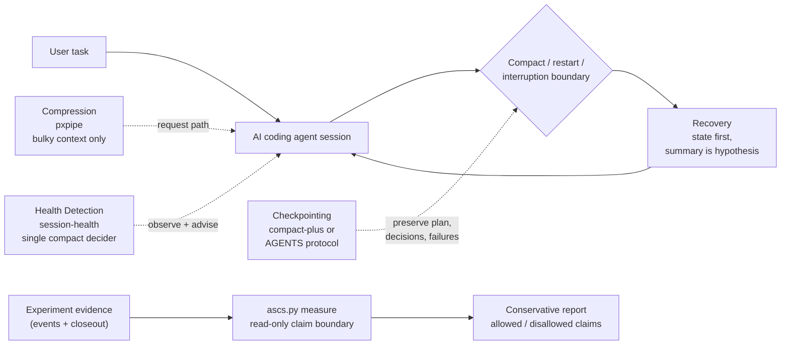

# Agent Session Control Stack

[](https://github.com/House-lovers7/agent-session-control-stack/actions/workflows/test.yml)

A reference architecture and lightweight tooling layer for controlling long-running AI coding agent sessions.

ASCS does not replace the three upstream OSS projects; it composes their
separate responsibilities safely.

ASCS helps you compose:

- **Compression** — reduce bulky context safely
- **Health Detection** — detect when a session is getting hot
- **Checkpointing** — preserve plans, decisions, failed attempts, and worker topology
- **Recovery** — resume safely after compaction, interruption, or a fresh-session restart

Core rule:

> Summary and state are untrusted hypotheses. Current source and fresh evidence are truth.

日本語版: [README.ja.md](README.ja.md)

## What you can use today

ASCS is not only a design document. You can use it today in four practical ways.

New here? The **[User Guide](docs/user-guide.md)** walks through what each layer does, setup, day-to-day use, and troubleshooting in one document.

### 1. Diagnose your Claude Code stack

Install the read-only ASCS doctor:

```bash
claude plugin marketplace add House-lovers7/agent-session-control-stack
claude plugin install ascs@ascs
```

Then run this inside Claude Code:

```text
/ascs:doctor
```

It reports which layers are active:

- Compression: `pxpipe`
- Health Detection: `claude-code-session-health`
- Checkpoint / Recovery: `compact-plus`
- Single compact decider rule

The doctor is read-only. It does not install hooks, start proxies, call APIs, or modify configuration.

### 2. Run the Claude Code reference stack

```bash
claude plugin marketplace add House-lovers7/agent-session-control-stack
claude plugin install session-health@ascs
claude plugin install compact-plus@ascs
claude plugin install ascs@ascs
```

This gives you the reference Claude Code composition:

- `session-health` decides when the session is getting hot.
- `compact-plus` preserves and restores state around compaction.
- `ascs` checks whether the stack is composed safely.

`pxpipe` is optional and separate because it is a request-path proxy:

```bash
npx -y pxpipe-proxy@0.8.0
alias claude-px='ANTHROPIC_BASE_URL=http://127.0.0.1:47821 claude'
```

Read the safety notes before enabling `pxpipe`. It is lossy by design and should not be used for byte-exact values such as commit SHAs, IDs, secrets, exact paths, migration names, or deploy targets.

### 3. Use the Codex native-hook adapter

Current Codex releases expose `PreCompact`, `PostCompact`, and
`SessionStart(source=compact)` hooks. ASCS uses those native lifecycle events
for a deterministic compact-boundary receipt and a one-shot recovery guard:

- copy or merge `examples/codex/.codex/hooks.json`
- copy `examples/codex/.codex/hooks/ascs_compact.py`
- review and trust the exact hook definition with `/hooks`
- keep the `AGENTS.md` handoff protocol as the state-writing contract and as a
  fallback when project hooks are unavailable or disabled

The hook never parses or copies the Codex transcript. It records only whether a
transcript path was supplied and which known state files already exist.

Exercise the checked-in JSON subprocess contract without starting Codex or a
model:

```bash
python3 -B scripts/smoke_codex_compact.py
```

This does not prove live runtime dispatch. See the
[Codex synthetic smoke boundary](docs/codex-compact-synthetic-smoke.md).

The portable fallback remains available:

- copy or adapt `examples/codex/AGENTS.md`
- create a `.agent-session/` directory
- keep handoff, plan, decisions, failed attempts, and recovery notes on disk
- make the next session read those files before continuing work

Start here:

```text
examples/codex/AGENTS.md
templates/state-file.md
```

Keep `/.agent-session/` ignored and treat it as untrusted recovery context,
never as authorization. Before reading live state, run the read-only check:

```bash
python3 scripts/check_state.py --repo /path/to/consumer-repo
```

Trust rules, metadata, expiry, cleanup, and rollback are defined in
[docs/state-trust-contract.md](docs/state-trust-contract.md).

### 4. Generate a conservative claim-boundary report

ASCS also includes a lightweight measurement helper:

```bash
python3 scripts/ascs.py doctor
python3 scripts/ascs.py measure --experiment 004
```

The measurement path is intentionally conservative. It reports:

- observed facts
- allowed claims
- disallowed claims
- blockers
- next required evidence

It does not claim productivity gains, model superiority, speed improvements, or a validated full-stack composition effect.

## What this repo is / is not

- This **is** a reference stack for long-running AI coding agent sessions.
- This is **not** a benchmark.
- It does **not** bundle upstream code — plugins are listed **by reference**: installing pulls the authors' original repositories unmodified ([ATTRIBUTION.md](ATTRIBUTION.md)).
- It helps you **diagnose and preserve** long-running agent sessions across compaction and restarts.
- The composition effect is **not proven yet** — see [Evidence status](#evidence-status).

## Problem

Long-running AI coding agents fail in predictable ways:

- context bloat
- cache re-read waste
- compact-induced state loss
- repeated failed approaches
- lost plan / worker topology
- unsafe recovery after summarization

## Thesis

Do not treat this as one problem. Separate it into four layers:

1. **Compression** — shrink bulky input context
2. **Health Detection** — notice when a session has gone hot, and intervene through the model itself
3. **Checkpointing** — preserve plan, decisions, failed attempts, and worker topology before context is lost
4. **Recovery** — resume safely: *summary is hypothesis, source is truth*

The layer contracts are independent — each can be adopted or removed on its own.

One Claude Code binding caveat: Checkpoint and Recovery both ship through `compact-plus`, so they are adopted and removed as a pair.

## Architecture at a glance



Architecture and claim-boundary map:
- [docs/architecture.md](docs/architecture.md) explains why ASCS uses four layers, why it does not replace the three upstream projects, and why claim boundaries are part of the architecture.
- [docs/claim-boundary-model.md](docs/claim-boundary-model.md) defines the `measure` verdict rules, allowed / disallowed claims, and void / stopped / incomplete classifications.
- [HTML architecture view](docs/architecture.html)

## Existing projects

- [pxpipe](https://github.com/teamchong/pxpipe) (teamchong): compression layer
- [claude-code-session-health](https://github.com/House-lovers7/claude-code-session-health) (House-lovers7): health detection layer
- [compact-plus](https://github.com/u-ichi/compact-plus) (u-ichi): checkpoint/recovery layer

This repository does **not** replace them and bundles none of their code. It documents how to compose them safely.

## Claude Code reference stack

> - Let **session-health** decide when the session is hot.
> - Let **compact-plus** preserve and restore working state around compaction.
> - Let **pxpipe** reduce bulky input context, but never compress byte-exact values.

The one rule that keeps the composition from conflicting: both session-health and compact-plus can tell the model to compact, on different criteria. This stack designates a **single decider** — session-health — and disables the compact-plus reminder *by construction*: the reminder only fires if an external statusline writes a warn-marker file, so not installing that producer turns it off while compact-plus's state capture and recovery keep working untouched.

### Detailed setup

```bash
claude plugin marketplace add House-lovers7/agent-session-control-stack
claude plugin install session-health@ascs
claude plugin install compact-plus@ascs
claude plugin install ascs@ascs        # optional: /ascs:doctor, read-only stack diagnosis
```

The upstream plugins are listed **by reference**: installing them pulls the authors' original repositories ([House-lovers7/claude-code-session-health](https://github.com/House-lovers7/claude-code-session-health), [u-ichi/compact-plus](https://github.com/u-ichi/compact-plus)) unmodified — nothing is vendored or rebranded (see [ATTRIBUTION.md](ATTRIBUTION.md)). pxpipe is a request-path proxy, not a plugin; it stays a separate opt-in (read [Safety](#safety) first):

```bash
npx -y pxpipe-proxy@0.8.0              # proxy on 127.0.0.1:47821
alias claude-px='ANTHROPIC_BASE_URL=http://127.0.0.1:47821 claude'
```

If Claude Code stops responding right after enabling pxpipe, the usual cause is `ANTHROPIC_BASE_URL` pointing at a proxy that is not running — see [Troubleshooting](docs/claude-code/recommended-stack.md#troubleshooting-pxpipe).

Stable upstream versions and immutable source revisions are recorded in [config/upstreams.lock.json](config/upstreams.lock.json); the human-approved compatibility update process is documented in [docs/upstream-compatibility.md](docs/upstream-compatibility.md).

- Setup, hook ownership, env conventions: [docs/claude-code/recommended-stack.md](docs/claude-code/recommended-stack.md)
- Config snippet: [examples/claude-code/settings.example.json](examples/claude-code/settings.example.json)
- End-to-end integration walkthrough and a worked demo: [docs/claude-code-reference-integration.md](docs/claude-code-reference-integration.md) · [examples/claude-code/stack-demo/](examples/claude-code/stack-demo/)

## Codex reference stack

The Claude Code and Codex adapters are intentionally separate — the same layer contracts, implemented on each runtime's native surface. Current Codex releases expose native compact lifecycle hooks. The reference adapter uses `PreCompact` and `PostCompact` to record a local, content-minimized boundary receipt, then `SessionStart(source=compact)` to inject a one-shot recovery guard. `AGENTS.md` still owns the durable behavior: update `.agent-session/` state while working, treat it as untrusted recovery context, and verify it before use. The same 10-section checkpoint shape remains portable across runtimes.

Project hooks only load for trusted projects, non-managed hooks require review of their exact definition, and administrators can disable non-managed hooks. When the native hook is unavailable, ASCS degrades to the manual handoff protocol rather than claiming deterministic recovery.

- Native hook and fallback design: [docs/codex/adapter-design.md](docs/codex/adapter-design.md)
- Drop-in protocol: [examples/codex/AGENTS.md](examples/codex/AGENTS.md)
- Templates: [templates/](templates/)

## Safety

pxpipe is the strongest and highest-risk layer. It is lossy by design: in upstream's own tests, a 12-character hex string in a dense image was read back correctly 13/15 times by Fable 5 and 0/15 by Opus 4.8 — and misreads are silent confabulation, not errors. Byte-exact values (hashes, IDs, secrets, paths, migration names, deploy targets) must stay text, and per-category exclusions are **not configurable** via `npx` today; the practical control is routing byte-exact work to non-allowlisted models.

Read [docs/claude-code/pxpipe-safety.md](docs/claude-code/pxpipe-safety.md) before enabling pxpipe.

For smaller jobs, unclear ownership, byte-exact work, or workflows without a
separate approval gate, read [docs/when-not-to-use.md](docs/when-not-to-use.md)
before adding this stack.

## Measurement

Upstream projects publish their own numbers (pxpipe: ~59–70% end-to-end bill reduction in its README snapshots; session-health: median 66% in-session context reduction from `/compact`, normalized cacheRead/output 233x→83x — framed by its author as consistency evidence, not causality). **The composition effect — running all three together — has not been empirically validated yet.**

This repository defines what "it works" would mean before claiming it: metrics, experiment protocol, and explicit withdrawal criteria — if post-compact drift, re-proposed rejected options, repeated failures, and per-deliverable token cost don't improve, the integration is just added complexity.

- [docs/measurement-plan.md](docs/measurement-plan.md) · [docs/risk-register.md](docs/risk-register.md) (risks, unverified points, withdrawal criteria)
- [docs/measurement-harness.md](docs/measurement-harness.md) — `scripts/ascs.py`, a manual Phase 2 recording helper (repo-shape doctor + experiment capture). It is not the Phase 4+ automated tooling. The early runs under [experiments/](experiments/) validate the harness itself; Experiment 002 ([summary](experiments/2026-07-06-codex-handoff-002-summary.md)) is the first manual n=1 before/after pair for the Codex handoff protocol — consistency evidence only, and still not the composition effect.

ASCS is not just a design document anymore: `scripts/ascs.py measure` is a conservative claim-boundary measure path. It can generate a conservative report for recorded experiment evidence — the built-in Experiment 004 set or any experiment directory — classify stopped / void / not-run evidence without making productivity claims, and reject output paths that would overwrite core evidence files.

It renders the machine-checked claim boundary — ASCS evidence-loop evidence, upstream runtime evidence, composition evidence, and the claims the evidence does **not** support ([model](docs/claim-boundary-model.md)). It reads evidence files and writes only when an explicit non-evidence `--output` path is provided:

```sh
# built-in Experiment 004 evidence
python3 scripts/ascs.py measure --experiment 004

# any experiment directory: arms are the directory itself and/or immediate
# subdirectories containing events.jsonl; p<N> name tokens group arms into pairs
python3 scripts/ascs.py measure --experiment-dir experiments/<your-experiment>

# write a markdown report (never into evidence directories)
python3 scripts/ascs.py measure --experiment 004 --format markdown \
  --output /tmp/experiment-004-claim-boundary.md
```

Example output (Experiment 004, abridged):

```text
ASCS MEASURE RESULT
- Experiment status: STOPPED / no valid comparison
- Pair statuses:
  - Pair 1: VOID condition 3 (void pair; no treated-vs-baseline claim)
  - Pair 2: NOT RUN (incomplete pair; not a failure)
- Evidence level: evidence-loop validation only
- ASCS evidence-loop: checkpoint recording evidence; no recovery evidence
- Layer evidence:
  - compression (pxpipe (teamchong)): no evidence
  - health_detection (claude-code-session-health (House-lovers7)): no evidence
  - checkpoint_recovery (compact-plus (u-ichi)): no evidence
- Composition evidence: no composition evidence
```

## Evidence status

ASCS has not yet measured a full-stack composition effect.

What is currently demonstrated:
- public correction of an invalid Experiment 002 speed claim;
- preregistered void handling and closeout in Experiment 003;
- a Claude Code reference integration v0 with local Dogfood 0.1 usability/safety checks;
- a full-stack mechanism smoke in one real session — all three layers activated together and the single-decider rule held ([case study](docs/case-study-dogfood-0.2.md); mechanism evidence only, not efficacy);
- separation of experiment records from product work;
- Experiment 004 stopped without a valid comparison (Pair 1 void condition 3 via an operator scope_differs audit; Pair 2 not run), and `scripts/ascs.py measure` machine-checks that claim boundary instead of leaving it to prose.

Next: Experiment 005 — a new pre-registered fresh-session restart attempt with standardized conditions (Opus as the standard runtime).

## Attribution

This repository is an integration/reference architecture. It does not claim ownership of the underlying ideas or implementations. Credits and details: [ATTRIBUTION.md](ATTRIBUTION.md). If you are an upstream author and find anything misrepresented, please open an issue — corrections take priority.

**Disclosure**: claude-code-session-health and this repository share the same maintainer. The single-decider recommendation above is argued on technical grounds, not authorship — see [ATTRIBUTION.md](ATTRIBUTION.md) and [docs/claude-code/recommended-stack.md](docs/claude-code/recommended-stack.md); challenges to it are welcome.

## More

- Living architecture / claim-boundary architecture: [architecture](docs/architecture.md)
- Assetized audit-to-fix workflow and current register: [improvement loop](docs/improvement-loop.md) · [`config/improvements.json`](config/improvements.json)
- No-model compact-plus marker/recovery contract check: [synthetic smoke](docs/compact-plus-synthetic-smoke.md)
- Design originals (Phase 0, Japanese): [hook responsibilities](docs/hook-responsibilities.md) · [adapter interface](docs/adapter-interface.md) · [Codex AGENTS.md draft](docs/codex/agents-md-draft.md) · [implementation plan](docs/implementation-plan.md) · [acceptance criteria](docs/acceptance-criteria.md) · [risk register](docs/risk-register.md) · [measurement plan](docs/measurement-plan.md)
- Roadmap: Phase 0 design ✅ → Phase 1 reference architecture ✅ → Phase 2 real-session before/after measurement (the harness, read-only Doctor, and conservative measurement helper are implemented; composition effect remains unmeasured) → Phase 3 upstream collaboration → Phase 4+ productization (config generator and automated benefit measurement only if Phase 2 clears the withdrawal criteria)
- License: MIT — [LICENSE](LICENSE)

<!-- BEGIN GENERATED ENGINEERING HANDBOOK -->
## Engineering handbook

- [Start here](./docs/engineering/README.md)
- [Architecture / system diagram](./docs/engineering/02_architecture.md)
- [API](./docs/engineering/04_api.md) / [Data model](./docs/engineering/05_data_model.md) / [Screens](./docs/engineering/06_screen_design.md)
- Detected checks: `python3 -m unittest discover tests -v` and `python3 scripts/validate_repo.py --require-upstream-lock`
- Snapshot: API 0 / persistent DB 0 / screen 0 / test files 9
- Data sources: `scripts/exp004.py`, `scripts/exp005.py`
- Handoff gaps and non-goals — [details](./docs/engineering/00_one_pager.md#引継ぎ時の未解決ギャップ)

> Generated from the current checkout. Existing ADR/schema/runbook remains authoritative; production state is not asserted.
<!-- END GENERATED ENGINEERING HANDBOOK -->
