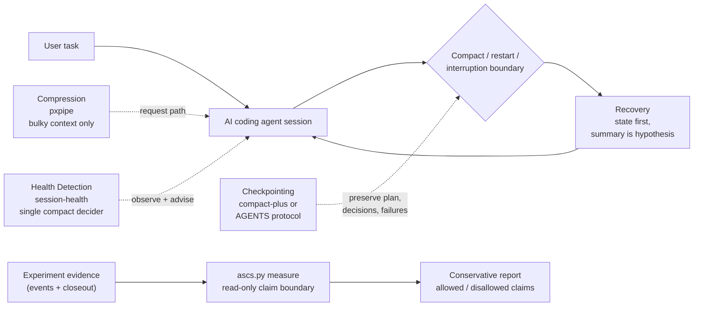

# Agent Session Control Stack

A reference architecture for long-running AI coding agent sessions.

日本語版: [README.ja.md](README.ja.md)

## Problem

Long-running AI coding agents fail in predictable ways:

- context bloat
- cache re-read waste
- compact-induced state loss
- repeated failed approaches
- lost plan / worker topology
- unsafe recovery after summarization

## Thesis

Do not treat this as one problem. Separate it into four layers:

1. **Compression** — shrink bulky input context
2. **Health Detection** — notice when a session has gone hot, and intervene through the model itself
3. **Checkpointing** — preserve plan, decisions, failed attempts, and worker topology before context is lost
4. **Recovery** — resume safely: *summary is hypothesis, source is truth*

The layer contracts are independent — each can be adopted or removed on its own. (One binding-level caveat: on Claude Code, Checkpoint and Recovery both ship in compact-plus, so they are adopted and removed as a pair.)

## Architecture at a glance



Architecture and claim-boundary map:
- [docs/architecture.md](docs/architecture.md) explains why ASCS uses four layers, why it does not replace the three upstream projects, and why claim boundaries are part of the architecture.
- [docs/claim-boundary-model.md](docs/claim-boundary-model.md) defines the `measure` verdict rules, allowed / disallowed claims, and void / stopped / incomplete classifications.
- [HTML architecture view](docs/architecture.html)

## Existing projects

- [pxpipe](https://github.com/teamchong/pxpipe) (teamchong): compression layer
- [claude-code-session-health](https://github.com/House-lovers7/claude-code-session-health) (House-lovers7): health detection layer
- [compact-plus](https://github.com/u-ichi/compact-plus) (u-ichi): checkpoint/recovery layer

This repository does **not** replace them and bundles none of their code. It documents how to compose them safely.

## Claude Code reference stack

> - Let **session-health** decide when the session is hot.
> - Let **compact-plus** preserve and restore working state around compaction.
> - Let **pxpipe** reduce bulky input context, but never compress byte-exact values.

The one rule that keeps the composition from conflicting: both session-health and compact-plus can tell the model to compact, on different criteria. This stack designates a **single decider** — session-health — and disables the compact-plus reminder *by construction*: the reminder only fires if an external statusline writes a warn-marker file, so not installing that producer turns it off while compact-plus's state capture and recovery keep working untouched.

### Install (marketplace)

```bash
claude plugin marketplace add House-lovers7/agent-session-control-stack
claude plugin install session-health@ascs
claude plugin install compact-plus@ascs
claude plugin install ascs@ascs        # optional: /ascs:doctor, read-only stack diagnosis
```

The upstream plugins are listed **by reference**: installing them pulls the authors' original repositories ([House-lovers7/claude-code-session-health](https://github.com/House-lovers7/claude-code-session-health), [u-ichi/compact-plus](https://github.com/u-ichi/compact-plus)) unmodified — nothing is vendored or rebranded (see [ATTRIBUTION.md](ATTRIBUTION.md)). pxpipe is a request-path proxy, not a plugin; it stays a separate opt-in (read [Safety](#safety) first):

```bash
npx -y pxpipe-proxy                    # proxy on 127.0.0.1:47821
alias claude-px='ANTHROPIC_BASE_URL=http://127.0.0.1:47821 claude'
```

- Setup, hook ownership, env conventions: [docs/claude-code/recommended-stack.md](docs/claude-code/recommended-stack.md)
- Config snippet: [examples/claude-code/settings.example.json](examples/claude-code/settings.example.json)
- End-to-end integration walkthrough and a worked demo: [docs/claude-code-reference-integration.md](docs/claude-code-reference-integration.md) · [examples/claude-code/stack-demo/](examples/claude-code/stack-demo/)

## Codex reference stack

The Claude Code and Codex adapters are intentionally separate — the same layer contracts, implemented on each runtime's native surface. Codex has no compaction lifecycle hooks, so this stack does not emulate them. The same Checkpoint/Recovery contracts become a **session handoff protocol**: an `AGENTS.md` that tells the agent to read `.agent-session/handoff.md` and state files before working, log decisions and failed attempts as it works, and write a handoff before stopping. The checkpoint snapshot uses the same 10 sections as a compact-plus state file, so handoffs can cross runtimes.

This is a weaker guarantee than hooks — protocol adherence instead of deterministic execution — and is stated as such.

- Design: [docs/codex/adapter-design.md](docs/codex/adapter-design.md)
- Drop-in protocol: [examples/codex/AGENTS.md](examples/codex/AGENTS.md)
- Templates: [templates/](templates/)

## Safety

pxpipe is the strongest and highest-risk layer. It is lossy by design: in upstream's own tests, a 12-character hex string in a dense image was read back correctly 13/15 times by Fable 5 and 0/15 by Opus 4.8 — and misreads are silent confabulation, not errors. Byte-exact values (hashes, IDs, secrets, paths, migration names, deploy targets) must stay text, and per-category exclusions are **not configurable** via `npx` today; the practical control is routing byte-exact work to non-allowlisted models.

Read [docs/claude-code/pxpipe-safety.md](docs/claude-code/pxpipe-safety.md) before enabling pxpipe.

For smaller jobs, unclear ownership, byte-exact work, or workflows without a
separate approval gate, read [docs/when-not-to-use.md](docs/when-not-to-use.md)
before adding this stack.

## Measurement

Upstream projects publish their own numbers (pxpipe: ~59–70% end-to-end bill reduction in its README snapshots; session-health: median 66% in-session context reduction from `/compact`, normalized cacheRead/output 233x→83x — framed by its author as consistency evidence, not causality). **The composition effect — running all three together — has not been empirically validated yet.**

This repository defines what "it works" would mean before claiming it: metrics, experiment protocol, and explicit withdrawal criteria — if post-compact drift, re-proposed rejected options, repeated failures, and per-deliverable token cost don't improve, the integration is just added complexity.

- [docs/measurement-plan.md](docs/measurement-plan.md) · [docs/risk-register.md](docs/risk-register.md) (risks, unverified points, withdrawal criteria)
- [docs/measurement-harness.md](docs/measurement-harness.md) — `scripts/ascs.py`, a manual Phase 2 recording helper (repo-shape doctor + experiment capture). It is not the Phase 4+ automated tooling. The early runs under [experiments/](experiments/) validate the harness itself; Experiment 002 ([summary](experiments/2026-07-06-codex-handoff-002-summary.md)) is the first manual n=1 before/after pair for the Codex handoff protocol — consistency evidence only, and still not the composition effect.

ASCS is not just a design document anymore: `scripts/ascs.py measure` is the first conservative claim-boundary measure path, starting with Experiment 004. It can generate a conservative report for recorded Experiment 004 evidence, classify stopped / void / not-run evidence without making productivity claims, and reject output paths that would overwrite core evidence files.

It renders the machine-checked claim boundary — ASCS evidence-loop evidence, upstream runtime evidence, composition evidence, and the claims the evidence does **not** support ([model](docs/claim-boundary-model.md)). It reads evidence files and writes only when an explicit non-evidence `--output` path is provided:

```sh
python3 scripts/ascs.py measure --experiment 004
python3 scripts/ascs.py measure --experiment 004 --format markdown \
  --output /tmp/experiment-004-claim-boundary.md
```

Example output (Experiment 004, abridged):

```text
ASCS MEASURE RESULT
- Experiment status: STOPPED / no valid comparison
- Pair statuses:
  - Pair 1: VOID condition 3 (void pair; no treated-vs-baseline claim)
  - Pair 2: NOT RUN (incomplete pair; not a failure)
- Evidence level: evidence-loop validation only
- ASCS evidence-loop: checkpoint recording evidence; no recovery evidence
- Layer evidence:
  - compression (pxpipe (teamchong)): no evidence
  - health_detection (claude-code-session-health (House-lovers7)): no evidence
  - checkpoint_recovery (compact-plus (u-ichi)): no evidence
- Composition evidence: no composition evidence
```

## Evidence status

ASCS has not yet measured a full-stack composition effect.

What is currently demonstrated:
- public correction of an invalid Experiment 002 speed claim;
- preregistered void handling and closeout in Experiment 003;
- a Claude Code reference integration v0 with local Dogfood 0.1 usability/safety checks;
- separation of experiment records from product work;
- Experiment 004 stopped without a valid comparison (Pair 1 void condition 3 via an operator scope_differs audit; Pair 2 not run), and `scripts/ascs.py measure` machine-checks that claim boundary instead of leaving it to prose.

Next: Experiment 005 — a new pre-registered fresh-session restart attempt with standardized conditions (Opus as the standard runtime).

## Attribution

This repository is an integration/reference architecture. It does not claim ownership of the underlying ideas or implementations. Credits and details: [ATTRIBUTION.md](ATTRIBUTION.md). If you are an upstream author and find anything misrepresented, please open an issue — corrections take priority.

**Disclosure**: claude-code-session-health and this repository share the same maintainer. The single-decider recommendation above is argued on technical grounds, not authorship — see [ATTRIBUTION.md](ATTRIBUTION.md) and [docs/claude-code/recommended-stack.md](docs/claude-code/recommended-stack.md); challenges to it are welcome.

## More

- Living architecture / claim-boundary architecture: [architecture](docs/architecture.md)
- Design originals (Phase 0, Japanese): [hook responsibilities](docs/hook-responsibilities.md) · [adapter interface](docs/adapter-interface.md) · [Codex AGENTS.md draft](docs/codex/agents-md-draft.md) · [implementation plan](docs/implementation-plan.md) · [acceptance criteria](docs/acceptance-criteria.md) · [risk register](docs/risk-register.md) · [measurement plan](docs/measurement-plan.md)
- Roadmap: Phase 0 design ✅ → Phase 1 docs-only reference architecture (this set) → Phase 2 before/after measurement (harness ready — `scripts/ascs.py`; first n=1 before/after pair recorded — [Experiment 002](experiments/2026-07-06-codex-handoff-002-summary.md); composition effect still unmeasured) → Phase 3 upstream collaboration → Phase 4+ tooling (generator / install-state doctor / automated measurement), only if Phase 2 clears the withdrawal criteria
- License: MIT — [LICENSE](LICENSE)
