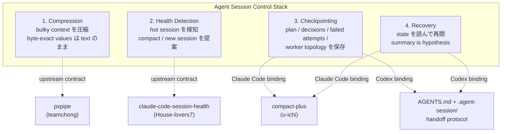
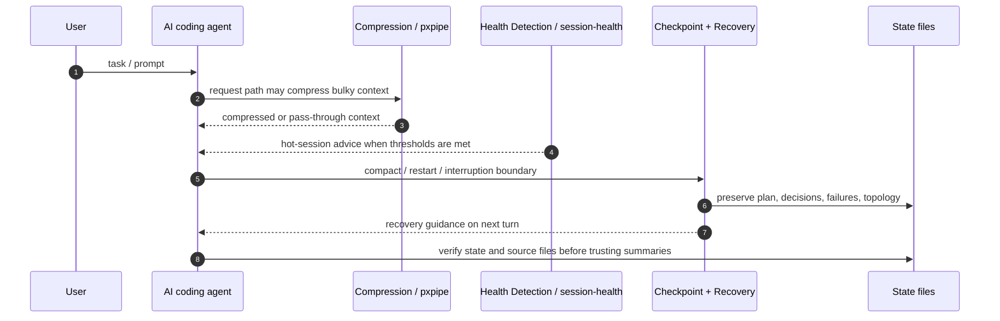
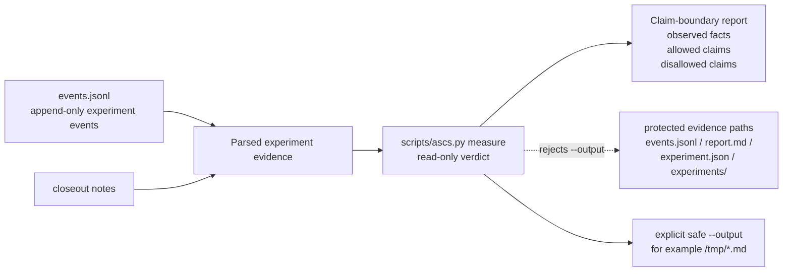

# Agent Session Control Stack — Architecture

> Living architecture document. Phase 0 の設計原本を起点に、Phase 2 以降の evidence / claim-boundary 実装を反映する。事実関係・責務境界・claim boundary の基準文書として扱う。

## 1. 位置づけ

Agent Session Control Stack は、長時間動作する AI コーディングエージェントのための**参照アーキテクチャ**である。

- pxpipe / claude-code-session-health / compact-plus を**置き換えない**。各 OSS の責務を分離・合成する方法を示す
- Claude Code では hooks / plugin / local proxy として、Codex では AGENTS.md + state directory + checkpoint/handoff protocol として、同一の 4 層パターンを実装する

解く問題は 4 つで、互いに独立している。

| 問題 | 症状 |
|---|---|
| 入力トークン肥大 | system prompt / tool docs / 古い履歴 / 巨大 tool result が毎リクエスト再送される |
| 健全性劣化の未検知 | cache 再読込が output の 100〜300 倍に達しても誰も気づかない |
| compact 時の状態喪失 | plan・却下案・失敗試行・worker 構成が要約で消える |
| compact 後の判断崩壊 | 要約を事実として扱い、迷走・却下案の再提案・同じ失敗の再実行が起きる |

## 2. 4 層モデル

### 2.1 Layer contract map



### 2.2 Processing flow



### 2.3 Evidence and claim-boundary flow



The measure path is intentionally narrower than the architecture: Experiment
004 currently demonstrates read-only claim-boundary classification for recorded
evidence. It does not validate productivity, model quality, or the full-stack
composition effect.

### 2.4 Original compact view

```
┌────────────────────────────────────────────┐
│ Agent Session Control Stack                │
├────────────────────────────────────────────┤
│ 1. Compression Layer            (pxpipe)   │
│    bulky context を圧縮する                 │
│    - 大きな tool_result / 古い履歴          │
│    - static system prompt / tool docs      │
│    - byte-exact values は text のまま       │
├────────────────────────────────────────────┤
│ 2. Health Detection Layer  (session-health)│
│    畳み時を判定し、モデル自身に提案させる    │
│    - cacheRead/output ratio                │
│    - request count / hot session 判定       │
│    - compact 提案の唯一の意思決定者          │
├────────────────────────────────────────────┤
│ 3. Checkpoint Layer          (compact-plus)│
│    compact 前に作業状態を保存する            │
│    - transcript backup                     │
│    - 10 セクション state file               │
├────────────────────────────────────────────┤
│ 4. Recovery Layer            (compact-plus)│
│    compact 後の再開を安全化する              │
│    - recovery marker → 次プロンプトで注入    │
│    - summary is hypothesis,                │
│      state/plan/source is truth            │
└────────────────────────────────────────────┘
```

各層は独立に導入・撤去できる。層間の結合点は 2 箇所だけ:
(a) Health 層だけが「畳む」判断を出す、(b) Checkpoint/Recovery 層は文脈喪失イベント（compact・セッション境界・中断）の前後にのみ反応する。

なお契約（adapter-interface.md）としての 4 層は独立だが、Claude Code binding では Checkpoint と Recovery を同一 plugin（compact-plus）が実装するため、この 2 層は対で導入・撤去される。

## 3. 各層の責務と実装（Claude Code binding）

### 3.1 Compression — pxpipe

- `127.0.0.1:47821` のローカルプロキシ。`ANTHROPIC_BASE_URL` を差し替えて接続
- 画像化する: 大きな tool_result（目安 6,000 文字超）/ 折りたたみ済みの古い履歴 / static system prompt + tool docs
- 触らない: ユーザーメッセージ / 直近ターン / モデル出力 / allowlist（`PXPIPE_MODELS`、既定 `claude-fable-5,gpt-5.6`）外モデルへのリクエスト
- **lossy であることが本質的制約**。詳細は §6 と risk-register

### 3.2 Health Detection — session-health

- hook は **UserPromptSubmit 1 種のみ**。hot 時に約 60 トークンの additionalContext を 20 リクエストごと最大 1 回注入し、「/compact か新セッションの提案」「探索・定型作業の subagent 委譲」をモデル自身に促す閉ループ
- 判定: `hot = reqs≥80 or (reqs≥20 かつ cacheRead/output≥150)`、`warn = reqs≥50 or (reqs≥10 かつ ≥100)`。すべて env（`SESSION_HEALTH_*` 7 種）で調整可能
- compact 認識は PostCompact hook ではなく、transcript の `compact_boundary` レコード読取りで live segment（最後の compact 以降）をリセットする
- 実測（作者リポジトリの検証ログ）: /compact でセッション内 live context 中央値 66% 削減（n=29）、正規化 cacheRead/output 比 233x→83x（4 日系列）。**因果ではなく整合性の証拠**と作者自身が明記

### 3.3 Checkpoint — compact-plus（PreCompact）

- PreCompact hook ×2: transcript JSONL を `~/.claude/backups/transcripts/` にバックアップ + LLM バックエンドで 10 セクション state file を生成（`${TMPDIR}/claude-compact-state/<session_id>.md`）
- 10 セクション: Active Plan / Current Phase / TaskList Summary / Session Decisions / Constraints and Blockers / Worker Topology / Skills Invoked / Editing Files / Failed Attempts / Recovery Notes
- **注意**: state file 生成の既定バックエンドは `claude -p`（課金 API 呼び出し）。fallback は `codex exec`。env 空文字でスキップ可能

### 3.4 Recovery — compact-plus（PostCompact + UserPromptSubmit）

- PostCompact hook: recovery marker を書き、warn cooldown をリセット
- 次の UserPromptSubmit: marker を消費し、state file / active plan への参照と「**原ファイルが authoritative**（compact summary は仮説）」という注記を注入

## 4. 中心的な設計判断: compact 提案の一元化

主判定が 2 つあるとモデルへの指示が二重化する。本 stack では:

```
compact 提案の親:        session-health（唯一の畳み時判定者）
compact 前後の保全・復旧: compact-plus
入力圧縮:               pxpipe（判断に関与しない）
```

compact-plus にも「context 使用率 ≥ `COMPACT_WARN_THRESHOLD`（既定 60%）で /compact を推奨する reminder」があるが、**この機能は構成的に off にできる**:

- warn marker の生成者は compact-plus plugin の外部（作者の base repo の statusline.sh）にある。plugin 側の reminder hook は marker ファイルが存在しなければ即終了する（fail open）
- したがって **marker 生成側（statusline 連携）を導入しなければ、reminder は一度も発火せず、state capture / transcript backup / recovery 注入は独立して正常動作する**
- フォーク不要・設定変更不要。「導入しない」ことが off スイッチである

この「設定ではなく構成で競合を解消する」点が、本 stack の Claude Code binding の核心。

## 5. hook 責務分離（要約）

競合面は UserPromptSubmit のみ。詳細マトリクスは [hook-responsibilities.md](hook-responsibilities.md)。

| イベント | session-health | compact-plus | pxpipe |
|---|---|---|---|
| UserPromptSubmit | hot 警告注入（~60 tok、≤1/20req） | recovery 注入（compact 直後のみ）/ reminder（**構成的 off**） | 関与しない |
| PreCompact | — | backup + state capture | 関与しない |
| PostCompact | —（transcript 読取りで代替） | recovery marker | 関与しない |
| リクエスト経路 | — | — | proxy として圧縮 |

## 6. pxpipe safety boundary（lossy 境界）

pxpipe は明示的に lossy。dense image 内の 12 文字 hex 文字列の正読は Fable 5 で 13/15、Opus 4.8 で 0/15。誤読はエラーにならず **silent confabulation** になる。

```
画像化してよい（Image OK）:
  - 古い会話履歴 / 長いログ / 大量の説明文
  - tool docs / 再読可能なファイル内容

画像化してはいけない（Keep as text）:
  - hash / commit SHA / exact ID
  - API key / secret / credentials
  - file path の確定値 / migration 名 / deploy target
  - destructive command の内容
```

**重要な制約（検証済み）**: 上記の選別を pxpipe の設定で行うことは、npx 運用では**できない**。カテゴリ別トグル（`compressToolResults` 等）はライブラリ層のコードには存在するが、proxy/CLI 層に公開されていない。実際に取れる制御は:

1. モデル allowlist（`PXPIPE_MODELS`）— byte-exact 作業を allowlist 外モデルへ逃がす（例: `CLAUDE_CODE_SUBAGENT_MODEL=claude-sonnet-4-6` や agent frontmatter の `model:` 指定）
2. 恒久 off: `PXPIPE_MODELS=off`
3. 一時パススルー（無再起動、A/B 用）: `PXPIPE_DISABLE=1`

つまり安全設計は「危険な値を画像化しない設定」ではなく、「**byte-exact 作業をそもそも圧縮経路に乗せない運用**」として書く。存在しない安全設定を示唆しないこと。

## 7. Codex binding（共通抽象の別実装）

Codex には Claude Code の compact lifecycle（PreCompact/PostCompact hook）が存在しない前提で設計する。同じ 4 層を **session handoff protocol** として実装する:

- Compression: 現時点では移植しない（pxpipe の Codex CLI 接続は未検証。risk-register 参照）
- Health: session-health が測る指標面（cacheRead/output 等）に相当するものは未検証のため（risk-register 参照）、代理シグナル（経過時間 / tool call 数 / diff 量 / テスト失敗回数）+ 自己申告 checkpoint。wrapper による自動監視は Phase 2 以降
- Checkpoint: `.agent-session/state/` への手続き的書き込み（AGENTS.md が protocol を宣言）
- Recovery: 新セッション開始時に handoff.md → state ファイル群を読む手順

詳細は [adapter-interface.md](adapter-interface.md) と [codex/agents-md-draft.md](codex/agents-md-draft.md)。

## 8. 事実と推測の区分

- [高] §3 の各ツール仕様: 各リポジトリの README / ソース（hooks.json、session_health.py、transform.ts 等）を 2026-07-05 に直接確認
- [中] 3 ツール併用で長時間セッションの安定性・コスト効率が上がる — 各層の個別実測はあるが、**併用時の相乗・相互作用は未測定**
- [低] Codex binding の実効性 — AGENTS.md protocol をモデルがどこまで遵守するかは未検証

未検証点と撤退基準は [risk-register.md](risk-register.md)、測定計画は [measurement-plan.md](measurement-plan.md)。
