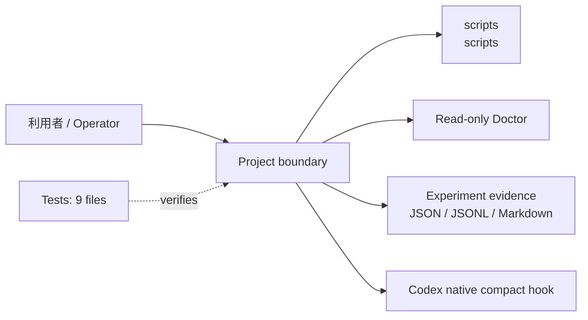
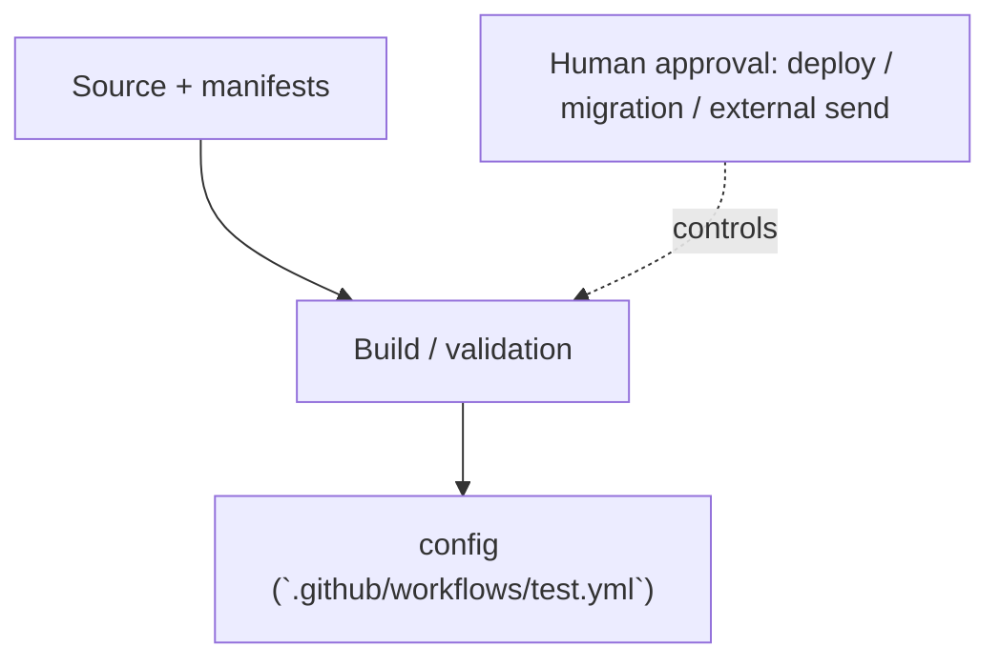

<!-- generated-by: scripts/generate_engineering_docs.py -->
# Agent Session Control Stack — アーキテクチャ・システム構成

> 生成日: 2026-07-15 / 対象: `agent-session-control-stack` / 確度: [高]
> 実装・manifest・既存資料の静的棚卸しに基づく。外部サービスの稼働状態と本番構成は未検証。

## 論理アーキテクチャ

## 配備・実行構成

## コンポーネント責務

| Component | Path | 責務 |
|---|---|---|
| `scripts` | `scripts` | CLI・バッチ・運用入口 |

### 検出したruntime / service

- `config (`.github/workflows/test.yml`)`

## 実装境界

- UI/HTTP API: 非提供（CLI・plugin command・hookが公開面）
- CLI: `scripts/ascs.py`, `scripts/check_state.py`, experiment helpers
- Hook/plugin: `plugins/ascs/`, `examples/codex/.codex/`
- Data: local JSON/JSONL/Markdown evidenceのみ。永続DBなし

## セキュリティ境界

- セキュリティ境界: read-only Doctor、state metadata/secret検査、hook trust、evidence fail-closed、外部送信と課金のHuman Approval Gate
- 設定名: CLAUDE_CONFIG_DIR, CLAUDE_PROJECT_DIR, TMPDIR, ANTHROPIC_BASE_URL, PATH（値は収集していない）
- deploy、migration、外部送信、課金はHuman Approval Gate対象。
