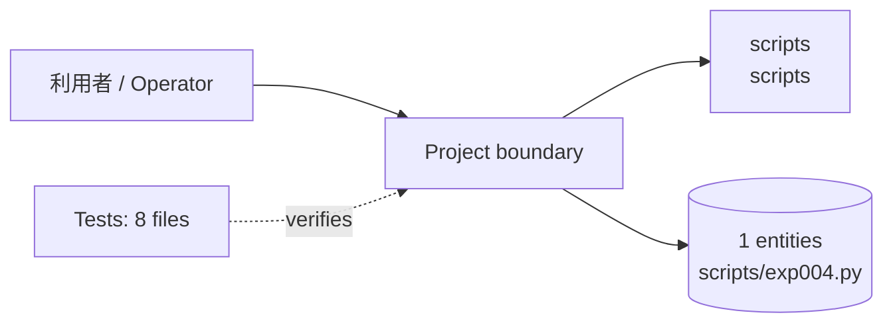
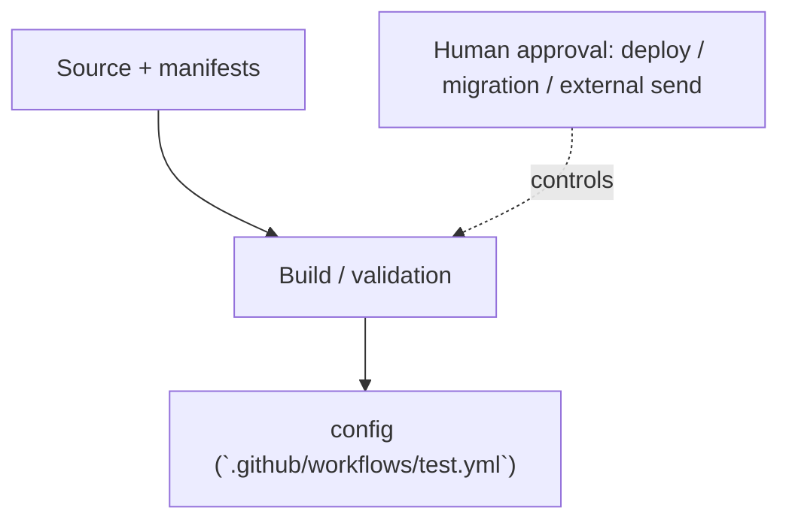

<!-- generated-by: scripts/generate_engineering_docs.py -->
# Agent Session Control Stack — アーキテクチャ・システム構成

> 生成日: 2026-07-15 / 対象: `agent-session-control-stack` / 確度: [高]
> 実装・manifest・既存資料の静的棚卸しに基づく。外部サービスの稼働状態と本番構成は未検証。

## 論理アーキテクチャ

## 配備・実行構成

## コンポーネント責務

| Component | Path | 責務 |
|---|---|---|
| `scripts` | `scripts` | CLI・バッチ・運用入口 |

### 検出したruntime / service

- `config (`.github/workflows/test.yml`)`

## 実装境界

- UI/入口: UI route未検出
- API: API route未検出
- Data: `scripts/exp004.py`, `scripts/exp005.py`
- External: integration名を静的検出できず

## セキュリティ境界

- 認証・回復性の実装シグナル: auth/session (`plugins/ascs/scripts/ascs_doctor.py`), resilience (`plugins/ascs/scripts/ascs_doctor.py`), auth/session (`tests/test_exp004.py`), tenant/RLS (`tests/test_exp004.py`), auth/session (`tests/test_exp005.py`), tenant/RLS (`tests/test_exp005.py`), auth/session (`tests/test_ascs.py`), auth/session (`tests/test_check_state.py`), auth/session (`tests/test_validate_repo.py`), auth/session (`tests/test_ascs_doctor.py`), resilience (`tests/test_ascs_doctor.py`), auth/session (`tests/test_exp003.py`)
- 設定名: CLAUDE_CONFIG_DIR, CLAUDE_PROJECT_DIR, TMPDIR, ANTHROPIC_BASE_URL, PATH（値は収集していない）
- deploy、migration、外部送信、課金はHuman Approval Gate対象。
