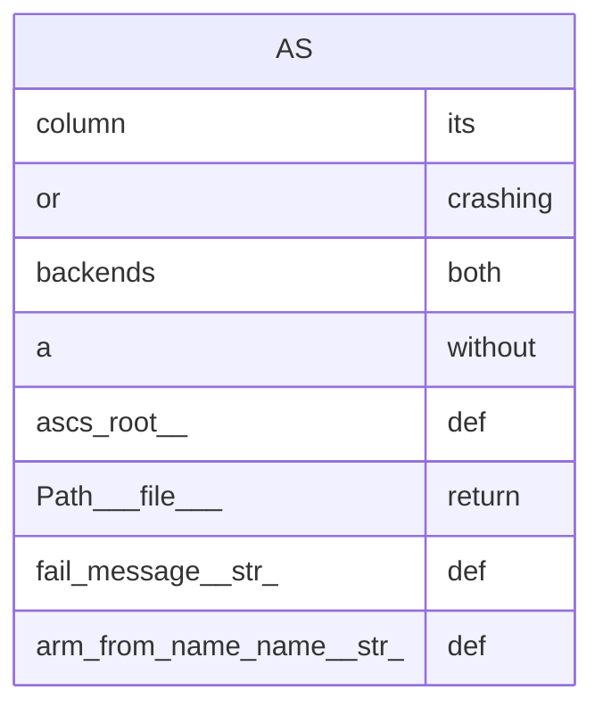

<!-- generated-by: scripts/generate_engineering_docs.py -->
# Agent Session Control Stack — データモデル・ER図

> 生成日: 2026-07-15 / 対象: `agent-session-control-stack` / 確度: [高]
> 実装・manifest・既存資料の静的棚卸しに基づく。外部サービスの稼働状態と本番構成は未検証。

## ER / データフロー

> [中] entity名はschema/migrationから直接検出。属性・関係は誤推測を避けるため、正典schemaで確認できないものを補完していない。

## Entity台帳

| Entity | 検出field | 根拠 | 未確認事項 |
|---|---|---|---|
| `AS` | `its: column`, `crashing: or`, `both: backends`, `without: a`, `def: ascs_root()`, `return: Path(__file__)`, `def: fail(message: str)`, `def: arm_from_name(name: str)`, `return: ARMS`, `def: experiment_path(arm: Arm)`, `return: ascs_root()`, `def: events_path(arm: Arm)` | `scripts/exp004.py`, `scripts/exp005.py` | constraint/retention確認 |

## Relation台帳

- relationを静的検出できず。relation定義・外部キー・application joinを確認

## 変更時の実務チェック

- schema/migration正典: `scripts/exp004.py`, `scripts/exp005.py`
- API影響: APIとの結線を検索
- tenant/user境界、主キー、一意制約、外部キー、削除方式、seed/fixtureをmigrationと照合する。
- migration/apply前にbackup、forward/backward compatibility、rollback可否をレビューする。
